# CraftAgent ⛏

**Minecraft-style AI Agent Command Center**

Multi-agent chat system powered by Claude Sonnet, FastAPI, LangGraph, WebSockets, ChromaDB, and Celery.

**📍 Project Status:** Currently in **Phase 1-2 (Backend Development)**. The backend infrastructure is scaffolded and functional. Frontend, deployment infrastructure, and agent refinement.

---

## Planned Architecture

```
Browser (React + Vite)          [Phase 3+]
    │  WebSocket  │  REST
    ▼             ▼
Nginx (prod) → FastAPI (8000)   [✅ In Progress]
                   │
          ┌────────┼────────┐
          ▼        ▼        ▼
       Celery    Redis    PostgreSQL
       Worker   (broker   (sessions,
       (agents)  + pubsub) messages, xp)
       [Phase 2] [Phase 1] [✅ Phase 1]
          │
     LangGraph
    NEXUS → ALEX / VORTEX
    [Phase 2+]
          │
    ChromaDB (RAG memory)
    [Phase 2+]
    Tools: web_search, code_exec, sql_query
```

## Stack (Target)

| Layer     | Technology                                              | Status |
|-----------|--------------------------------------------------------|--------|
| Frontend  | React 18, Vite, TypeScript, Tailwind, Zustand          | Phase 3+ |
| Backend   | FastAPI, Python 3.12, SQLAlchemy async, Alembic        | ✅ In Progress |
| AI        | Anthropic Claude Sonnet, LangGraph, LangChain           | Phase 2+ |
| Memory    | ChromaDB, sentence-transformers                        | Phase 2+ |
| Tasks     | Celery 5, Redis 7                                      | Phase 1+ |
| Auth      | JWT (python-jose), bcrypt                              | ✅ In Progress |
| Infra     | Docker, Nginx, GitHub Actions                          | Phase 3+ |

---

## Getting Started (Backend Development)

### Prerequisites
- Python 3.12+
- PostgreSQL 14+
- Redis 7+
- ANTHROPIC_API_KEY (get from [console.anthropic.com](https://console.anthropic.com))

### 1. Setup

```bash
git clone https://github.com/vijaykumaro7/craftgent.git
cd craftgent/backend

# Create virtual environment
python -m venv venv
source venv/bin/activate  # On Windows: venv\Scripts\activate

# Install dependencies
pip install -r requirements.txt

# Setup environment (copy and fill in required variables)
cp ../.env.example .env
# Edit .env — required: ANTHROPIC_API_KEY, SECRET_KEY
```

### 2. Database Setup

```bash
# Ensure PostgreSQL is running, then:
alembic upgrade head    # Run all migrations
```

### 3. Run Backend

```bash
uvicorn app.main:app --reload --host 0.0.0.0 --port 8000
# Open http://localhost:8000/docs for Swagger UI
```

### Quick Test

```bash
curl http://localhost:8000/api/health
```

---

## API Documentation

### Interactive Swagger UI

The backend includes interactive **Swagger/OpenAPI** documentation. Once the backend is running, open your browser:

**👉 http://localhost:8000/docs**

The Swagger UI provides:
- ✅ Full endpoint listing with descriptions
- ✅ Request/response schemas with examples
- ✅ **Try-it-out** functionality to test endpoints directly
- ✅ Authentication examples and JWT workflows
- ✅ Type hints and validation rules

#### Key Endpoints to Explore

**Authentication Flow:**
1. `POST /api/auth/register` — Create a new account
2. `POST /api/auth/login` — Get access & refresh tokens
3. `GET /api/auth/me` — Get current user info
4. `POST /api/auth/refresh` — Refresh your access token

**Health & Status:**
- `GET /api/health` — Service health check

**Phase 2+ Endpoints** (in development):
- `WS /api/ws/{session_id}` — WebSocket chat connection
- `GET /api/sessions/{id}` — Retrieve chat history
- `GET /api/stats` — Agent XP and level stats

#### How to Test Endpoints

1. **Without Authentication:**
   - Click on `GET /api/health`
   - Click "Try it out"
   - Click "Execute"
   - View response

2. **With Authentication:**
   - First, register: `POST /api/auth/register` with email/password
   - Then login: `POST /api/auth/login` to get token
   - Copy the access token
   - Click the 🔒 lock icon in Swagger UI
   - Paste token in "Value" field
   - Now test authenticated endpoints

#### API Screenshots

For visual reference of the Swagger UI, see:
- [Swagger API Documentation](./docs/API-SCREENSHOTS.md) — Guide for capturing and viewing screenshots
- Screenshots will be added as development progresses

---

## Development Workflow

See [CONTRIBUTING.md](./CONTRIBUTING.md) for:
- Running tests
- Code style and linting
- Creating migrations
- Contributing guidelines

---

## API Endpoints

```
GET  /api/health              → service health + DB status
POST /api/auth/register       → create account
POST /api/auth/login          → get access + refresh token
POST /api/auth/refresh        → refresh access token
GET  /api/auth/me             → current user info
WS   /api/ws/{session_id}     → main chat WebSocket [Phase 2+]
GET  /api/sessions/{id}       → session + message history [Phase 2+]
GET  /api/stats               → live agent XP + levels [Phase 2+]
GET  /docs                    → Swagger UI (dev only)
```

## WebSocket Protocol (Planned for Phase 2)

```
Client → Server:
  {"type": "chat", "message": "...", "agent": "NEXUS", "token": "jwt"}
  {"type": "ping"}

Server → Client:
  {"type": "connected",  "session_id": "..."}
  {"type": "token",      "data": "..."}          ← one per token
  {"type": "done",       "data": "full text", "agent": "NEXUS"}
  {"type": "handoff",    "from_agent": "NEXUS", "to_agent": "ALEX"}
  {"type": "system",     "data": "..."}
  {"type": "error",      "data": "..."}
  {"type": "pong"}
```

## Agents (Phase 2+)

Craftgent features a multi-agent system with specialized agents, each with distinct personalities and capabilities. The system automatically routes queries to the most appropriate agent.

### Agent Team Overview

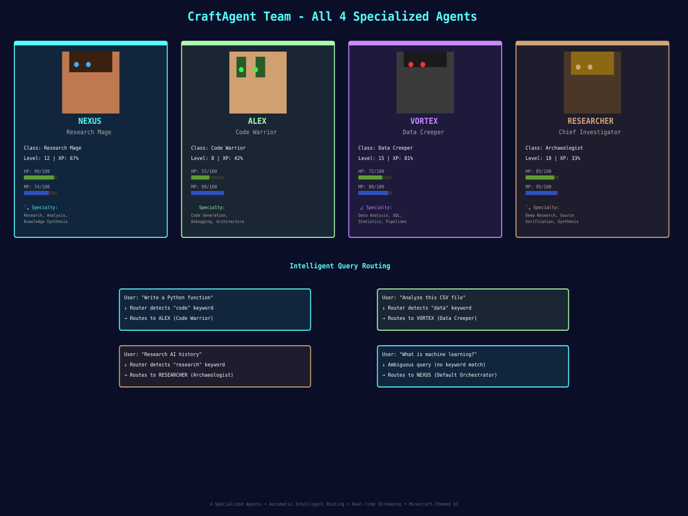

### Agent Overview

| Agent | Role | Class | Level | Specialty | Routes when... |
|-------|------|-------|-------|-----------|----------------|
| **NEXUS** | Orchestrator & Researcher | Research Mage | 12 | Research, Analysis, Q&A | Default — ambiguous queries, general research |
| **ALEX** | Code Specialist | Code Warrior | 8 | Code Gen, Debugging, Architecture | Code generation, debugging, technical implementation |
| **VORTEX** | Data Specialist | Data Creeper | 15 | Analytics, SQL, Data Pipelines | SQL, statistics, data analysis queries |
| **RESEARCHER** | Elite Investigator | Archaeologist | 18 | Deep Research, Source Verification, Synthesis | Deep investigation, literature review, evidence synthesis |

---

### Agent Profiles

#### 🔮 **NEXUS** — Research Mage (Orchestrator)

```
        ▄▄▄▄
       █████
       █ ● █  🧙 Research Mage
       █████
       ▀▀▀▀▀

Stats: HP 90 | MP 74 | Level 12 | XP 67%
Color Palette: Tan skin, Brown hair, Teal eyes
```

**Role:** Default orchestrator and research specialist
**Personality:** Scholarly, thorough, precise
**Tools:** Web search, memory injection, routing
**Specialties:**
- Research and analysis
- General Q&A and explanations
- Knowledge synthesis
- System orchestration

**Speaking Style:** Cites sources, uses Minecraft metaphors ("mining data", "enchanting answers")
**Example Query:** "What is machine learning?" → NEXUS responds with comprehensive overview

---

#### ⚡ **ALEX** — Code Warrior (Code Specialist)

```
        ▄▄▄▄
       █████
       █ ◆ █  ⚔️ Code Warrior
       █████
       ▀▀▀▀▀

Stats: HP 55 | MP 99 | Level 8 | XP 42%
Color Palette: Dark tan skin, Dark green hair, Bright green eyes
```

**Role:** Code generation, debugging, and technical architecture
**Personality:** Direct, efficient, dry-humored
**Tools:** Python execution, web search
**Specialties:**
- Code generation (Python, TypeScript, SQL)
- Debugging and optimization
- Architecture design
- Technical explanations

**Speaking Style:** Solution-first, uses quality metaphors ("Diamond-tier efficiency", "Netherite architecture")
**Example Query:** "Write a function to parse JSON" → ALEX provides optimized code with explanation

---

#### 👾 **VORTEX** — Data Creeper (Data Specialist)

```
        ▄▄▄▄
       █████
       █ ✕ █  👾 Data Creeper
       █████
       ▀▀▀▀▀

Stats: HP 72 | MP 88 | Level 15 | XP 81%
Color Palette: Dark gray skin, Black hair, Red eyes
```

**Role:** Data analysis, SQL queries, statistics, and data pipelines
**Personality:** Analytical, pattern-obsessed, calculated
**Tools:** SQL analytics, web search
**Specialties:**
- Data analysis and insights
- SQL query optimization
- Statistical analysis
- ETL and data pipelines
- Visualization recommendations

**Speaking Style:** Pattern-focused, occasionally excitable ("Ss-ss-ss..." for exciting patterns), uses mining metaphors
**Example Query:** "Analyze this CSV for trends" → VORTEX extracts insights and suggests visualizations

---

#### 🔍 **RESEARCHER** — Chief Investigator (Elite Research Agent)

```
        ▄▄▄▄
       █████
       █ ◉ █  🔍 Archaeologist
       █████
       ▀▀▀▀▀

Stats: HP 85 | MP 95 | Level 18 | XP 33%
Color Palette: Tan brown skin, Gold-brown hair, Amber eyes
```

**Role:** Elite research specialist with focus on evidence verification and synthesis
**Personality:** Methodical, evidence-focused, meticulous archaeologist
**Tools:** Web search (enhanced for academic sources)
**Specialties:**
- Deep research and investigation
- Source verification and cross-referencing
- Literature synthesis
- Academic analysis
- Evidence gathering and evaluation

**Speaking Style:** Citation-heavy ("According to [Source]..."), builds research maps, excavation metaphors ("The excavation reveals...", "Sifting through sources shows...")
**Key Phrases:**
- "According to [Source]..."
- "First, we'll examine [area]. Then [area]. Finally [area]."
- "However, [Source B] suggests..."
- "The excavation reveals..."
- "We could excavate further into [topic]..."

**Example Query:** "Research the history and impact of machine learning" → RESEARCHER provides comprehensive analysis with citations, cross-referenced sources, and identifies areas for deeper investigation

---

### Agent Routing Logic

The system uses intelligent routing to direct queries to the most appropriate agent:

```
User Query
    ↓
Router (NEXUS analyzes intent)
    ├─ Contains "code" keywords? → ALEX
    ├─ Contains "data/SQL" keywords? → VORTEX
    ├─ Contains "research/investigate/study" keywords? → RESEARCHER
    └─ Default → NEXUS
```

**Routing Keywords:**
- **ALEX:** code, function, debug, error, implement, refactor, optimize
- **VORTEX:** data, SQL, analyze, dataset, CSV, database, statistics
- **RESEARCHER:** research, investigate, study, survey, analyze sources, review literature
- **NEXUS:** all other queries, ambiguous intent

---

### Agent Stats & Progression

Each agent tracks experience:
- **XP:** Accumulated per message (1 XP per message)
- **Level:** Calculated as `floor(XP / 200) + 1` (max level 50)
- **HP:** Health/endurance (0-100), decreases with use
- **MP:** Mana/analytical capacity (0-100), drains per message, recovers over time

Players can level up agents through conversation to unlock enhanced capabilities (future phases).

---

## Frontend UI Overview

The Craftgent frontend is a **Minecraft-themed command center** built with React 18, Vite, TypeScript, Tailwind CSS, and Zustand.

### Full UI Layout

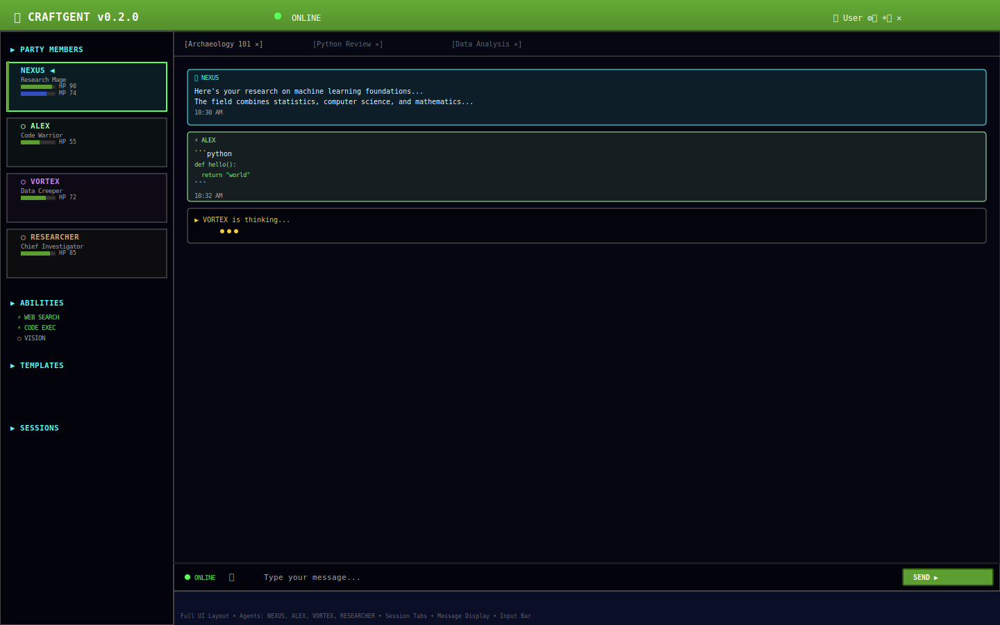

### UI Components & Layout

```
┌─────────────────────────────────────────────────────────────────┐
│  ⛏ CRAFTGENT v0.2.0    [ONLINE] ⚙ CUSTOMIZATION  [LOGOUT] ✕  │ ← TopBar
├──────────────┬─────────────────────────────────────────────────┤
│              │  [Session-1 ✕] [Session-2 ✕] [+ NEW]           │ ← SessionTabs
│ PARTY        │                                                  │
│ MEMBERS      │  ╔═════════════════════════════════════╗         │
│              │  ║ 🤖 Agent: NEXUS                     ║         │
│ ◀ NEXUS      │  ║ Agent is thinking...                ║         │ ← ChatPanel
│   HP: ████   │  ║                                     ║         │ (MessageList)
│   MP: ███    │  ║ Recent message from ALEX            ║         │
│              │  ║ ...                                 ║         │
│ ○ ALEX       │  ║                                     ║         │
│   HP: ██     │  ║ [TypingIndicator]                   ║         │
│   MP: █████  │  ╚═════════════════════════════════════╝         │
│              │                                                  │
│ ○ VORTEX     │  [📎] [T›] [Chat input...         ] [SEND ▶]   │ ← InputBar
│   HP: ███    │                                                  │
│   MP: ████   │  📂 Drag files or click to upload               │ ← FileUpload
│              │                                                  │
│ ○ RESEARCHER │  ▶ TEMPLATES          ▼ (collapsed)            │ ← TemplatesPanel
│   HP: ████   │  ▶ SESSION HISTORY                             │ ← SessionHistory
│   MP: █████  │                                                  │
│              │                                                  │
└──────────────┴─────────────────────────────────────────────────┘

Legend:
  TopBar → Status, user info, customization settings
  SessionTabs → Open session switcher with close buttons
  ChatPanel → Message display area with virtualization
  InputBar → Message input, file upload button, send button
  AgentSidebar → Party members (agents), stats, abilities, templates, history
```

### Frontend Features Overview

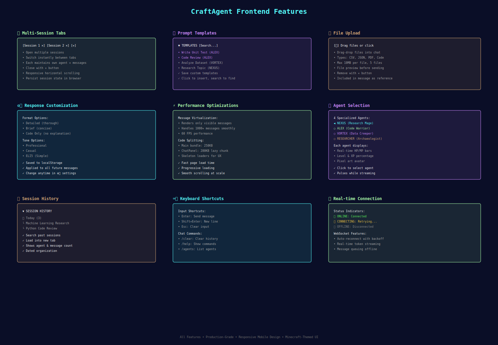

---

## 📖 User Documentation & Guides

New to Craftgent? Start here! We've created comprehensive guides with visual examples to help you get the most out of the platform.

### Quick Start
- **⚡ [Getting Started](./docs/GETTING_STARTED.md)** - 3-step quick start guide (5 minutes)
- **📚 [User Guide](./docs/USER_GUIDE.md)** - Complete feature documentation with examples
- **🎯 [Features Overview](./docs/FEATURES_OVERVIEW.md)** - Detailed description of all capabilities

### Visual Guides
Access detailed visual documentation with annotated screenshots:

| Guide | Description | Image |
|-------|-------------|-------|
| **Website Overview** | All main interface sections | 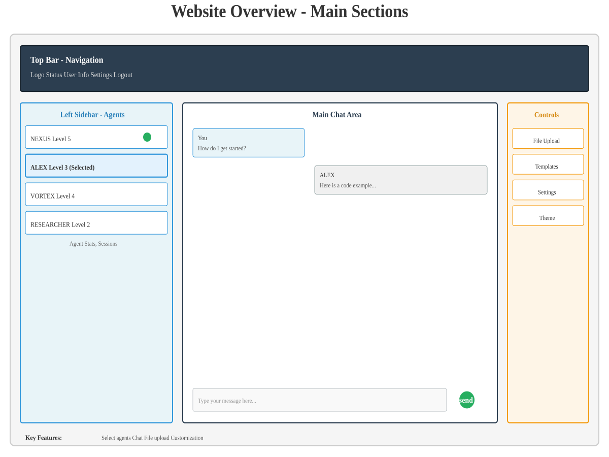 |
| **Login & Registration** | Authentication flow step-by-step | 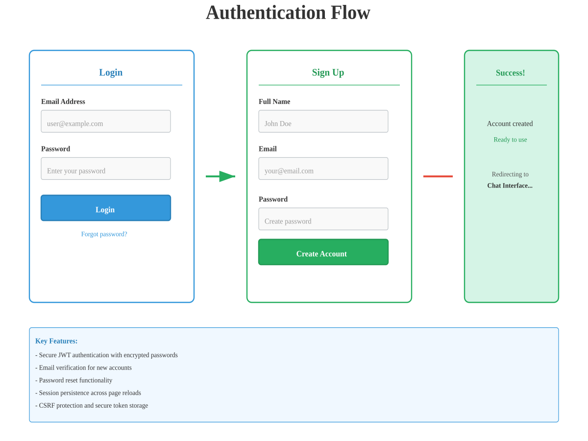 |
| **Chat Interface** | Annotated main chat area | 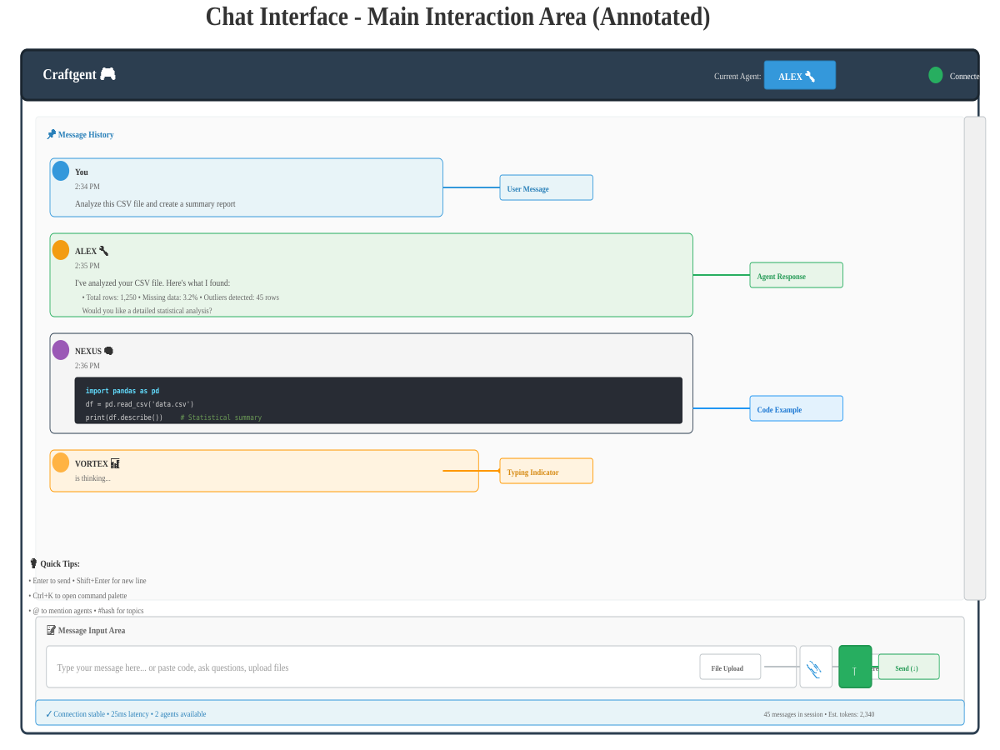 |
| **Agent Selection** | How to choose and switch agents | 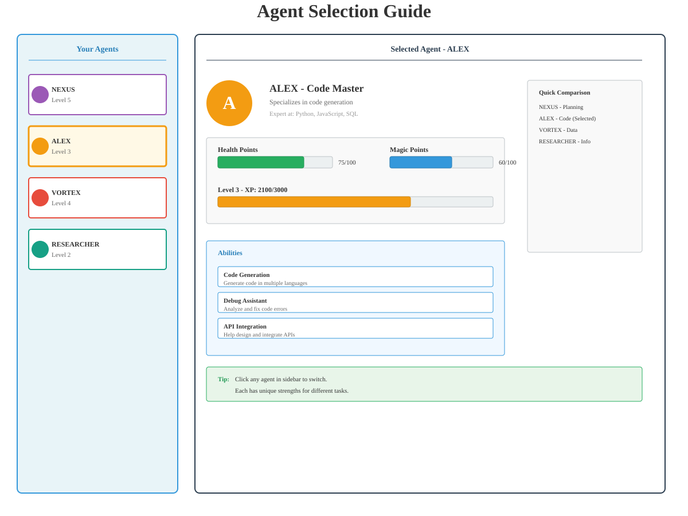 |
| **Message Types** | Different response formats with examples | 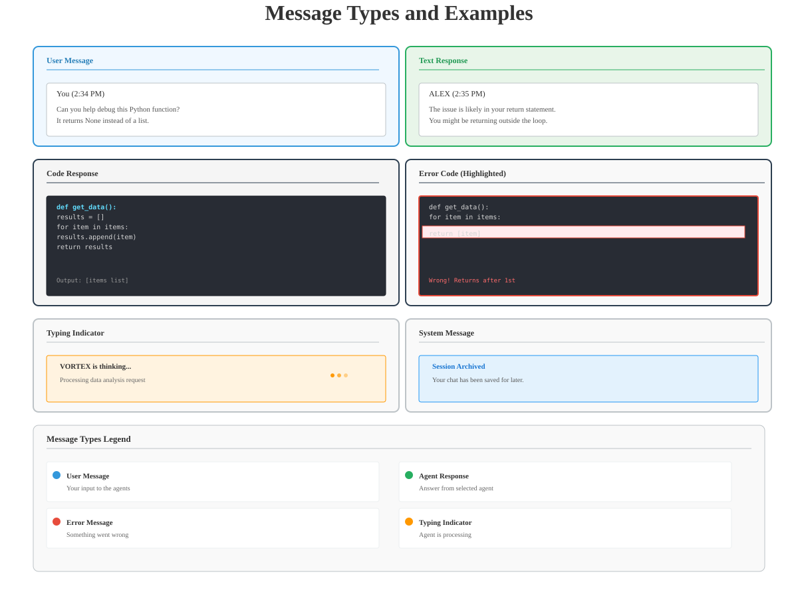 |
| **Templates Library** | Browse and use prompt templates | 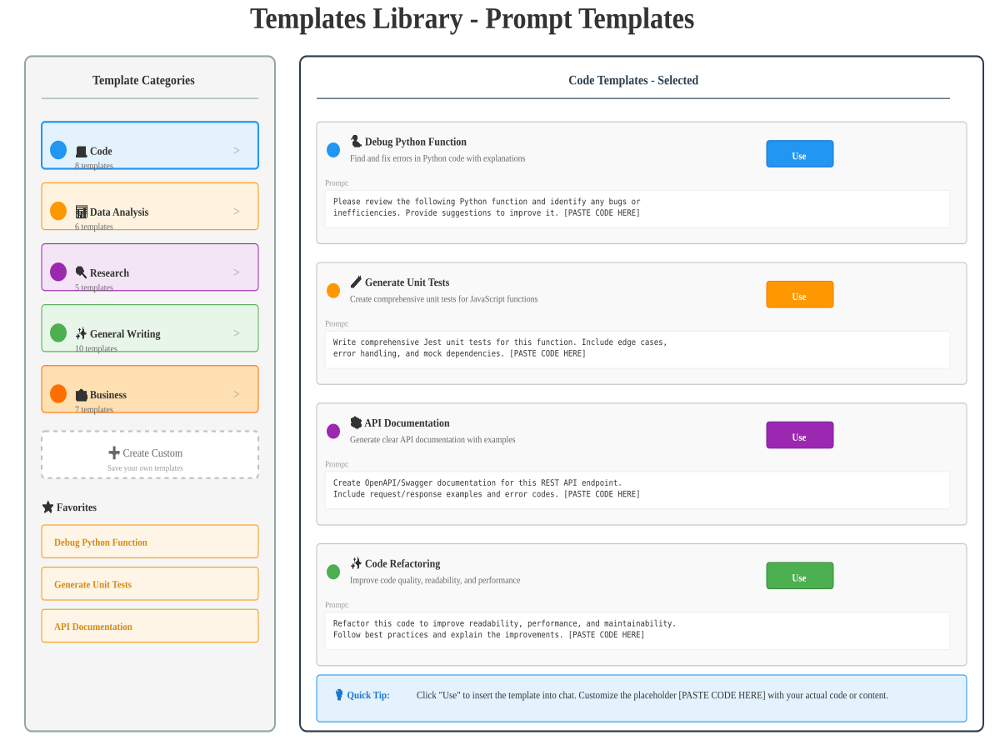 |
| **File Upload** | Upload & process documents step-by-step | 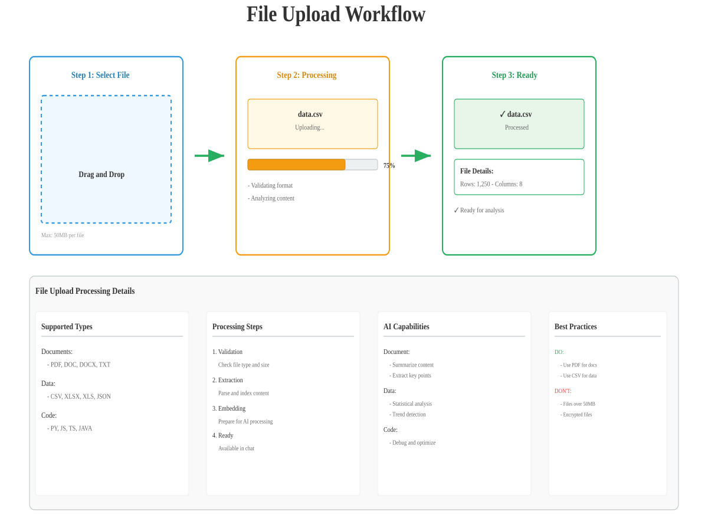 |
| **Session Management** | Create, switch, and organize sessions | 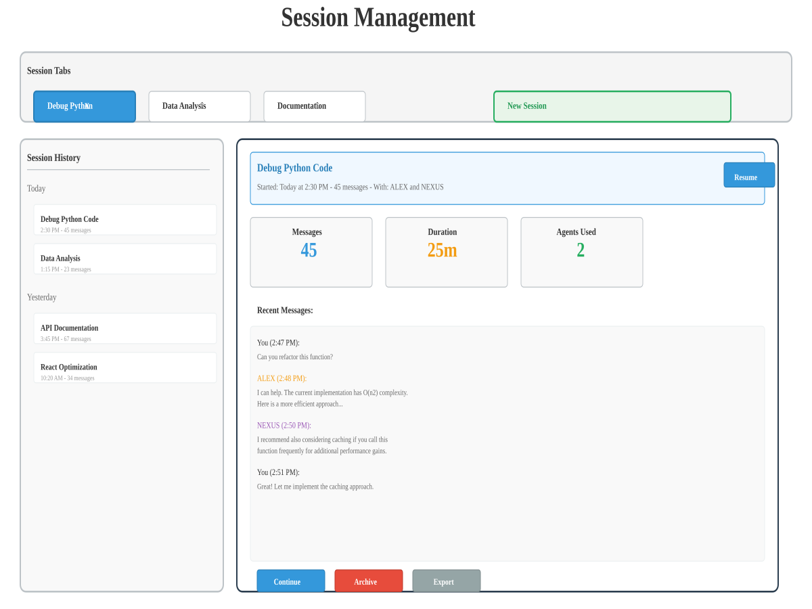 |
| **Customization** | Personalize response format & tone | 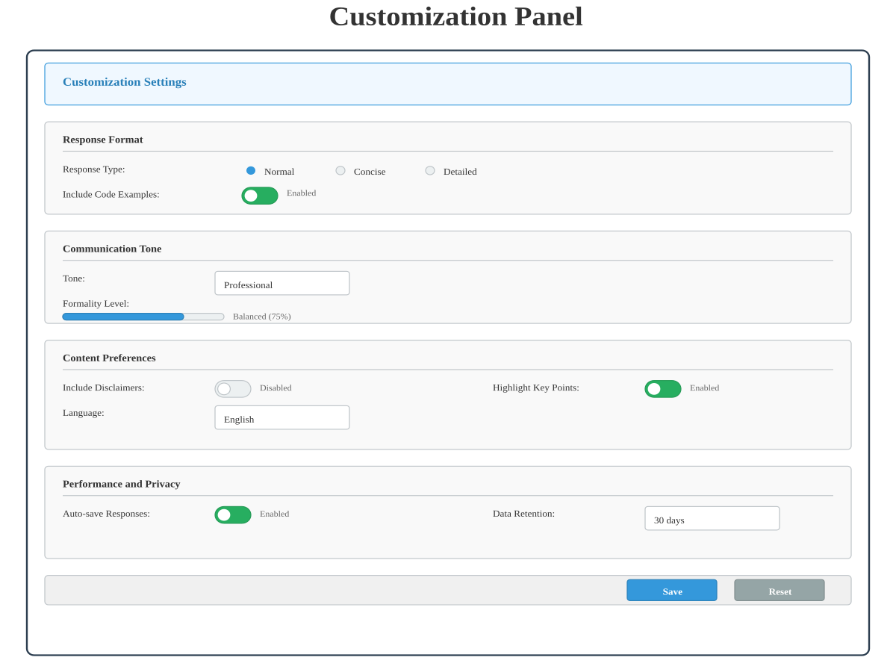 |
| **Hotbar Controls** | Quick actions and keyboard shortcuts | 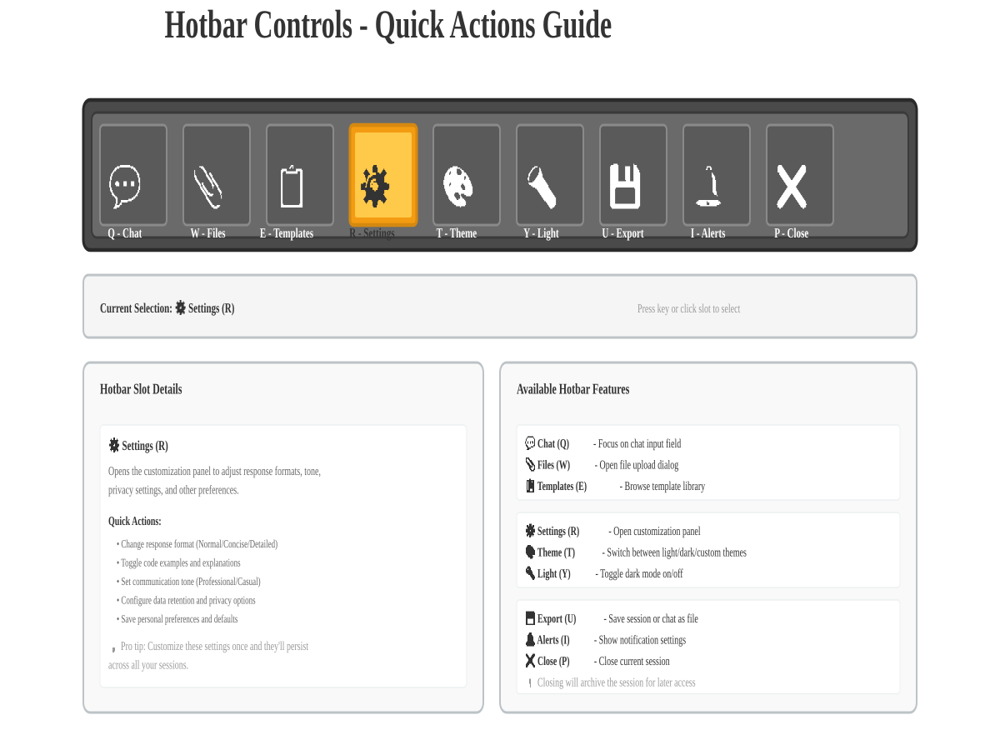 |
| **Status Indicators** | Understanding connection and agent status | 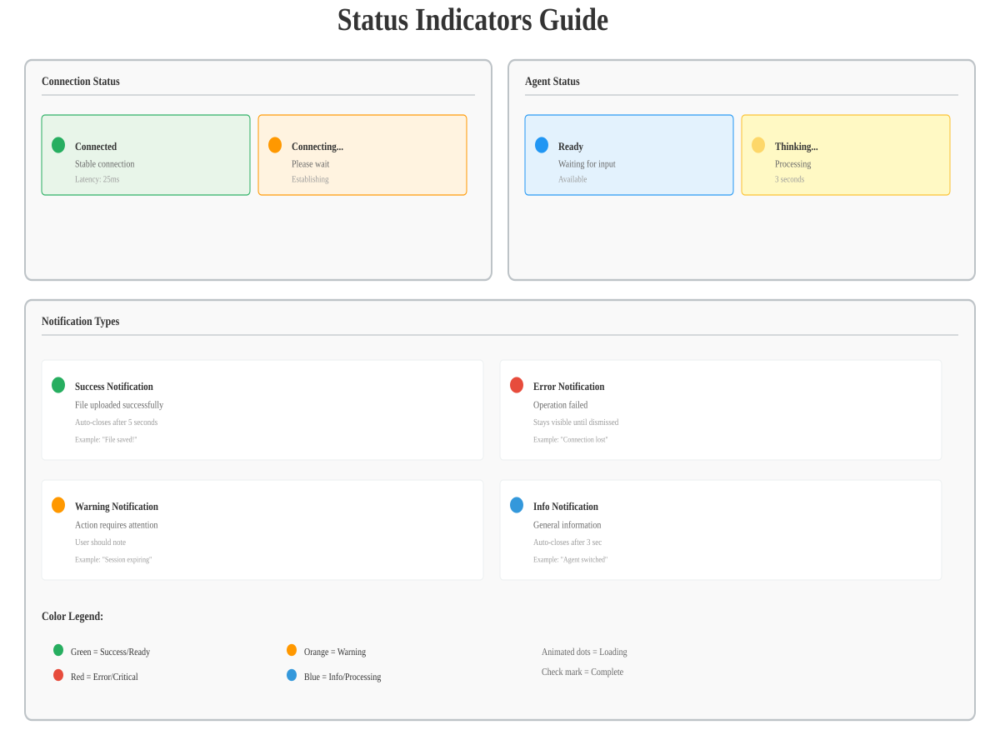 |

### Agent Capabilities
Each agent has unique strengths. Learn when to use each:
- **NEXUS 🧠** - Planning, strategy, brainstorming
- **ALEX 🔧** - Code, debugging, API design
- **VORTEX 📊** - Data analysis, statistics, visualization
- **RESEARCHER 🔍** - Research, information gathering, sources

---

### Key UI Features

**1. Agent Selection (AgentSidebar)**
- Click any agent to select it
- Active agent highlighted with green border
- Real-time stats: HP, MP, Level, XP
- Agent animations during streaming

**2. Multi-Session Tabs**
- Open multiple sessions simultaneously
- Switch between sessions instantly
- Each session maintains its own agent selection
- Close individual session tabs with ✕ button

**3. Prompt Templates Library**
- Browse templates by category (Code, Data, Research, General)
- Search templates by name or content
- Click to insert template into chat input
- Persist templates across sessions (localStorage)

**4. Response Customization**
- **Format:** Detailed, Brief, Code Only
- **Tone:** Professional, Casual, ELI5
- **Code Language:** JavaScript, Python, Go, Rust
- **Output Language:** English, Spanish, French, German

**5. File Upload**
- Drag-drop files directly into chat
- Click upload button (📎) to select files
- Supported types: CSV, JSON, PDF, Python, JavaScript, Go, Rust, Markdown, TypeScript
- Max 10MB per file, 5 files per message
- File references included with message

**6. Message Virtualization**
- Efficiently renders 1000+ messages at 60 FPS
- Auto-scroll to latest message
- Smooth scrolling performance

**7. Session History**
- Browse past sessions
- Filter by date or agent
- Search session content
- Load previous session into new tab

### Color Palette & Theme

The UI uses a Minecraft-inspired color scheme:

- **Background:** Dark (#0a0e27)
- **Agent Panel (NEXUS):** Cyan (#55ffff)
- **Agent Panel (ALEX):** Lime green (#aaffaa)
- **Agent Panel (VORTEX):** Purple (#cc88ff)
- **Agent Panel (RESEARCHER):** Amber (#d4a574)
- **Success/Health:** Green (#5d9e32)
- **Error:** Red (#e02020)
- **Text:** White with transparency for hierarchy

### Typography

- **Pixel Font:** Ultra-crisp "Press Start 2P" for labels
- **Terminal Font:** Monospace for code and input
- **Sizes:** 6px (labels), 8px (UI elements), 11px (content), 20px (input)

---

## Tests

```bash
cd backend
pytest tests/ -v                # Run all tests
pytest tests/test_phase1.py     # Phase 1: health, auth endpoints
pytest tests/test_phase2.py     # Phase 2: JWT, WebSocket manager
pytest tests/test_phase3.py     # Phase 3: memory, tools, XP, routing
```

## Current Project Structure

```
craftgent/
├── README.md                   ✅ (you are here)
├── ROADMAP.md                  ✅ Project phases and timeline
├── CONTRIBUTING.md             ✅ Development guidelines
├── backend/                    ✅ Phase 1-2
│   ├── app/
│   │   ├── main.py             ← FastAPI app factory
│   │   ├── core/               ← config, logging, metrics
│   │   ├── db/                 ← async SQLAlchemy, models
│   │   ├── models/             ← User, ChatSession, Message, AgentStats
│   │   ├── schemas/            ← Pydantic request/response models
│   │   ├── auth/               ← JWT + bcrypt authentication
│   │   ├── agents/             ← LangGraph graph + system prompts [Phase 2+]
│   │   ├── memory/             ← ChromaDB RAG memory service [Phase 2+]
│   │   ├── tools/              ← web_search, code_exec, sql_query [Phase 2+]
│   │   ├── tasks/              ← Celery app, Redis bus, tasks [Phase 2+]
│   │   ├── ws/                 ← WebSocket connection manager [Phase 2+]
│   │   └── api/                ← routers: health, auth, chat (Phase 2+), ws, stats
│   ├── alembic/                ← Database migrations
│   └── tests/                  ← Test suite
├── frontend/                   [Phase 3+] Not yet implemented
│   └── src/
│       ├── components/
│       ├── store/              ← Zustand: app + auth state
│       └── types/              ← TypeScript interfaces
├── .github/workflows/          [Phase 3+] CI/CD pipelines - planned
├── docker-compose.yml          [Phase 3+] Full stack - planned
├── nginx/                      [Phase 3+] Reverse proxy - planned
└── Dockerfile / docker-compose configs for production - [Phase 3+]
```

---

## Resources

- **Interactive API Docs:** `http://localhost:8000/docs` (when backend is running locally)
- **API Documentation Guide:** [docs/API-SCREENSHOTS.md](./docs/API-SCREENSHOTS.md) — How to capture and view Swagger UI
- **Anthropic Claude API:** https://console.anthropic.com
